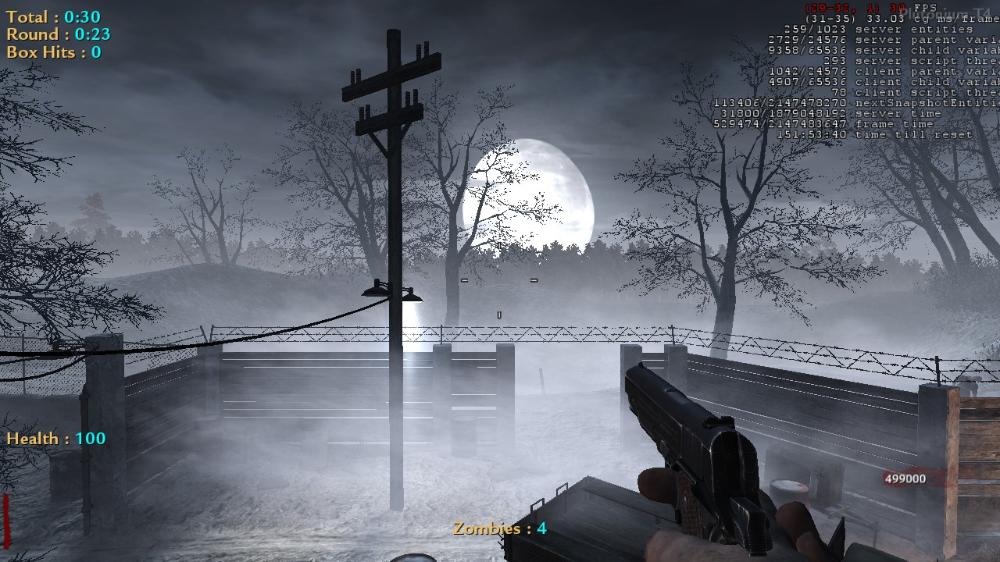
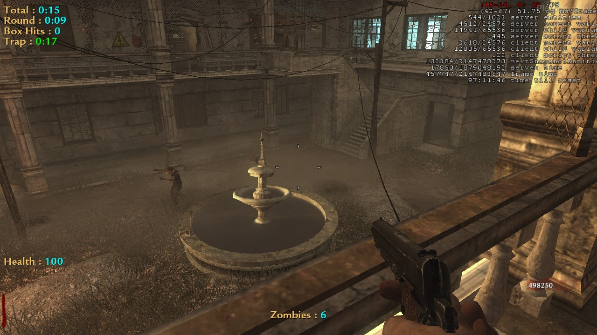
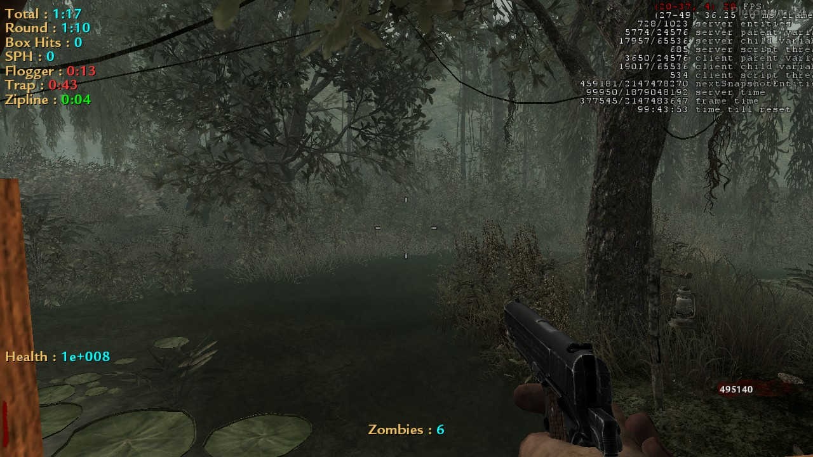
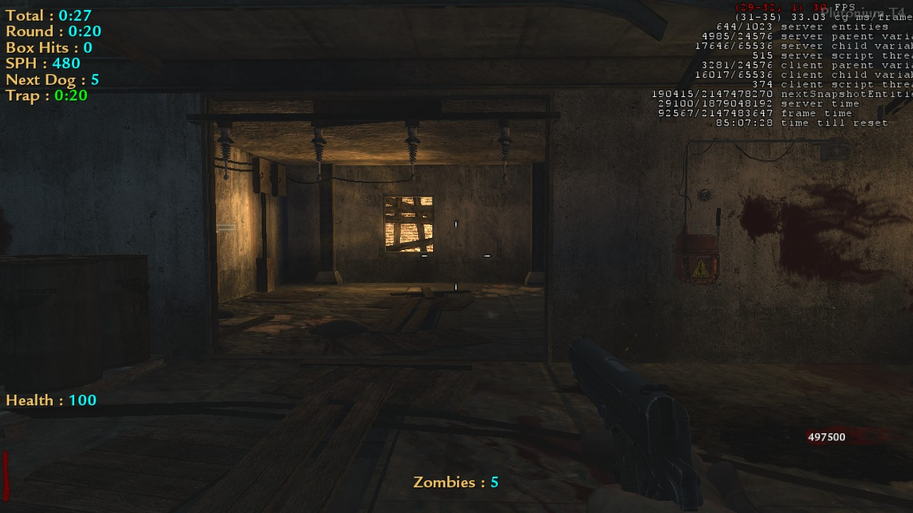

# Patch By Zombie AmazinG
### This patch has
- Timer
- Round Timer
- Box Hit
- Seconds Per Horde (only on shi no numa and der riese)
- Dog Tracker (only on der riese)
- Trap Timer (except on nacht)
- Flogger Timer
- Zipline Timer
- Zombie Counter
- Health Bar

##

### Commands to enable and disable the hud

!lobby  -> Total Timer
 
!round  -> Round Timer
 
!box    -> Box Hit Tracker
 
!sph    -> Seconds Per Horde Calculator
 
!dog    -> Show the next round of dogs
 
!health -> Health Counter
 
!zombie -> Zombie Counter
 
!trap   -> Trap Timer
 
!times  -> Show your times
- round 30
- round 50
- round 70
- round 100
- round 150
- round 200
- round 1000
- round 2000
- round 3000
- round 4000
- round 5000
- round 6000
- round 7000
- round 8000
- round 9000
- round 10000
- round 11000

### Example

##

### Observation
#### Do not use this patch if you want to play for a world record, as ZWR or ZHQ will not accept your record.
#### Just use for fun.

##
### Images for example

