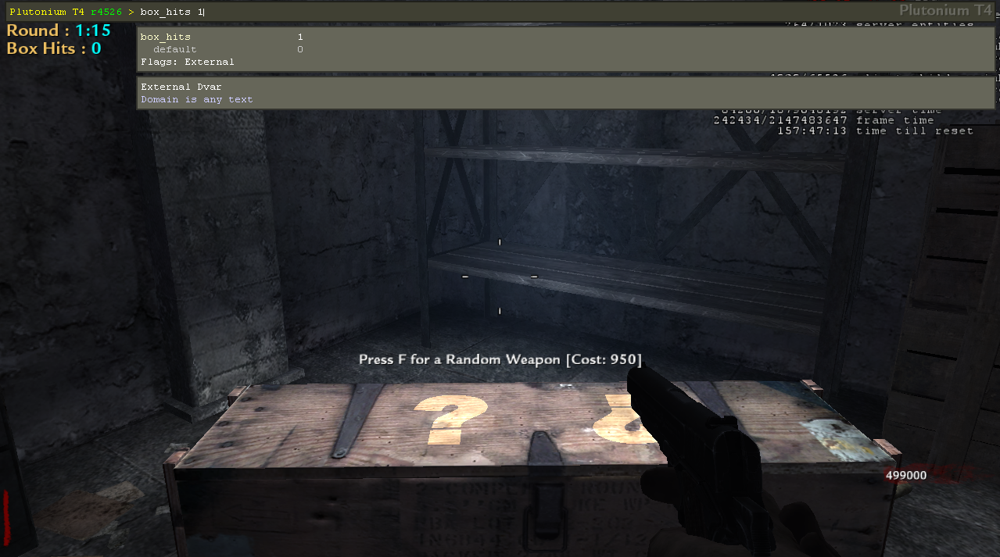

# Patch By Zombie AmazinG
### This patch has
- Timer
- Round Timer
- Box Hit
- Seconds Per Horde (only on shi no numa and der riese)
- Dog Tracker (only on der riese)
- Trap Timer (except on nacht)
- Flogger Timer (only on shi no numa)
- Zipline Timer (only on shi no numa)
- Zombie Counter
- Health Bar

##

### Commands to enable and disable the hud

- `lobby_timer` -> Total Timer `active on console`
- `round_timer` -> Round Timer `active on console`
- `box_hits` -> Box Hit Tracker `active on console`
- `sph` -> Seconds Per Horde Calculator `active on console`
- `next_dog` -> Show the next round of dogs `active on console`
- `hp` -> Health Counter `active on console`
- `zombie_counter` -> Zombie Counter `active on console`
- `trap_timer` -> Trap Timer `active on console`

### Example

##
### Other command

- `!time` + `round` -> See your times `active on chat`

### Example

### Times you can see

- round 30
- round 50
- round 70
- round 100
- round 150
- round 200
- round 1000
- round 2000
- round 3000
- round 4000
- round 5000
- round 6000
- round 7000
- round 8000
- round 9000
- round 10000
- round 11000
- round 12000

##

### Observation
#### Do not use this patch if you want to play for a world record, as ZWR or ZHQ will not accept your record.
#### Except you only use `lobby_timer`, `round_timer` and `!times`

##
### Images for example
#### Nacht Der Untoten

#### Verruckt

#### Shi No Numa

#### Der Riese
